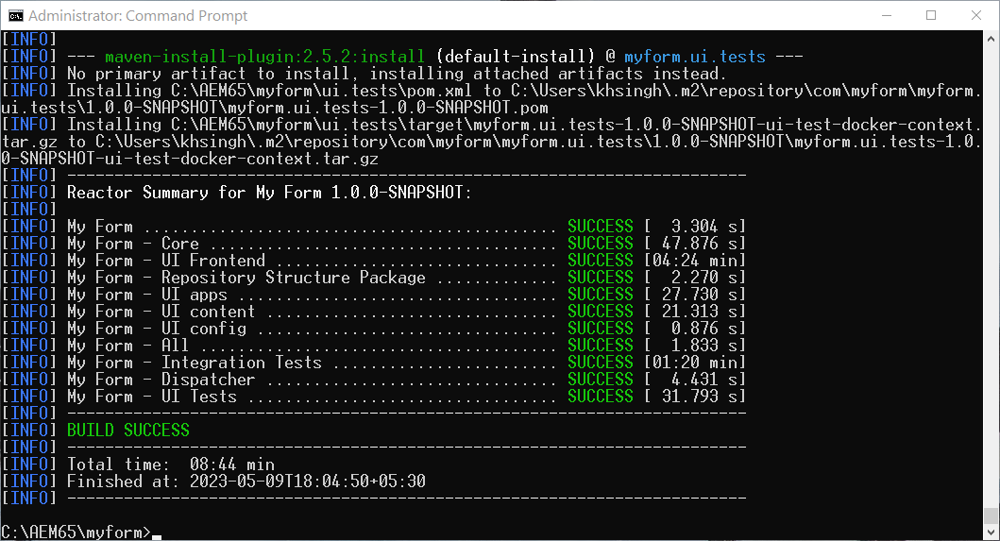

# Activation de Forms adaptatif sans affichage dans AEM Forms 6.5 {#enable-headless-adaptive-forms-on-aem-65-forms}

Pour activer le Forms adaptatif sans affichage dans votre environnement Forms 6.5 AEM, configurez un projet AEM Archetype 41 ou version ultérieure et déployez-le sur toutes vos instances d’auteur et de publication.

En déployant le projet basé sur AEM Archetype 41 ou version ultérieure sur vos instances Forms 6.5 AEM, vous pouvez [Création d’un Forms adaptatif basé sur les composants principaux](create-a-headless-adaptive-form.md). Ces formulaires sont représentés au format JSON et utilisés comme Forms adaptatif en tête et sans affichage, ce qui offre une plus grande flexibilité et une plus grande personnalisation sur un large éventail de canaux, y compris les applications mobiles, web et natives.

## Conditions préalables requises {#prerequisites}

Avant d’activer Headless Adaptive Forms dans AEM environnement Forms 6.5,

* [Mise à niveau vers AEM 6.5 Forms Service Pack 16 (6.5.16.0) ou version ultérieure](https://experienceleague.adobe.com/docs/experience-manager-65/release-notes/aem-forms-current-service-pack-installation-instructions.html).

* Installez la dernière version de [Apache Maven](https://maven.apache.org/download.cgi).

* Installez un éditeur de texte brut. Par exemple, Microsoft Visual Studio Code.

## Créer et déployer le dernier projet basé sur AEM Archetype

Pour créer un archétype AEM 41 ou [later](https://github.com/adobe/aem-project-archetype) basé sur le projet et le déployez sur toutes vos instances d’auteur et de publication :

1. Connectez-vous à votre ordinateur, en tant qu’administrateur, en hébergeant et en exécutant votre instance Forms AEM 6.5.
1. Ouvrez l’invite de commande ou le terminal.
1. Exécutez la commande suivante pour créer AEM projet basé sur Archetype 41 :

   * Microsoft Windows

   ```Shell
      mvn -B org.apache.maven.plugins:maven-archetype-plugin:3.2.1:generate ^
      -D archetypeGroupId=com.adobe.aem ^
      -D archetypeArtifactId=aem-project-archetype ^
      -D archetypeVersion=41 ^
      -D appTitle="My Form" ^
      -D appId="myform" ^
      -D groupId="com.myform" ^
      -D includeFormsenrollment="y" ^
      -D aemVersion="6.5.15" 
   ```

   * Linux ou Apple macOS

   ```Shell
      mvn -B org.apache.maven.plugins:maven-archetype-plugin:3.2.1:generate \
      -D archetypeGroupId=com.adobe.aem \
      -D archetypeArtifactId=aem-project-archetype \
      -D archetypeVersion=41 \
      -D appTitle="My Form" \
      -D appId="myform" \
      -D groupId="com.myform" \
      -D includeFormsenrollment="y" \
      -D aemVersion="6.5.15" 
   ```

   Lorsque vous exécutez la commande ci-dessus, veillez à tenir compte des points suivants :

   * Mettez à jour la commande afin de refléter les valeurs spécifiques de votre environnement, y compris appTitle, appId et groupId. En outre, définissez les valeurs de includeFormsenrollment sur &quot;y&quot;. Si vous utilisez Forms Portal, définissez la variable _includeExamples=y_ pour inclure les composants principaux du portail Forms dans votre projet.

   * Ne remplacez pas &quot;aemVersion&quot; de 6.5.15.0 par autre chose.

1. (Uniquement pour les projets basés sur la version 41 de l’archétype) Une fois le projet d’archétype AEM créé, activez les thèmes pour les Forms adaptatif basés sur les composants principaux. Pour activer les thèmes :

   1. Ouvrez le [AEM archetype Project Folder]/ui.apps/src/main/content/jcr_root/apps/__appId__/components/adaptiveForm/page/customheaderlibs.html pour modification :

   1. Ajoutez le code suivant à la ligne 21 :

      ```XML
      <sly data-sly-use.clientlib="core/wcm/components/commons/v1/templates/clientlib.html"
      data-sly-use.formstructparser="com.adobe.cq.forms.core.components.models.form.FormStructureParser"
      data-sly-test.themeClientLibRef="${formstructparser.themeClientLibRefFromFormContainer}">
      <sly data-sly-test="${themeClientLibRef}" data-sly-call="${clientlib.css @ categories=themeClientLibRef}"/>
      </sly>
      ```

      

   1. Enregistrez et fermez le fichier.

1. Mettez à jour le projet pour inclure la dernière version des composants principaux Forms :

   1. Ouvrez le [AEM archetype Project Folder]/pom.xml pour modification.
   1. Définir la version de `core.forms.components.version` et `core.forms.components.af.version` to [derniers composants principaux Forms](https://github.com/adobe/aem-core-forms-components/tree/release/650) version.

      

   1. Enregistrez et fermez le fichier.


1. Une fois le projet AEM Archetype créé, créez le package de déploiement pour votre environnement. Pour créer le module :

   1. Accédez au répertoire racine de votre projet AEM Archetype.


   1. Exécutez la commande suivante pour créer le projet AEM Archetype pour votre environnement :

      ```Shell
      mvn clean install
      ```

      


   Une fois le projet AEM Archetype créé, un module AEM est généré. Vous trouverez le package à l’adresse [AEM archetype Project Folder]\all\target\[appid].all-[version].zip

1. Utilisez la variable [Gestionnaire de modules](https://experienceleague.adobe.com/docs/experience-manager-65/administering/contentmanagement/package-manager.html?lang=fr) pour déployer le [AEM archetype Project Folder]\all\target\[appid].all-[version]Package .zip sur toutes les instances d’auteur et de publication.

>[!NOTE]
>
>
>
>Si vous rencontrez des difficultés pour accéder à la boîte de dialogue de connexion sur une instance de publication afin d’installer le module via le gestionnaire de modules, essayez de vous connecter à l’aide de l’URL suivante : http://[URL du serveur de publication]:[PORT]/system/console. Cela vous permet d’accéder à l’instance de publication, ce qui vous permet de poursuivre le processus d’installation.


Les composants principaux sont activés pour votre environnement. Un modèle de formulaire adaptatif basé sur des composants principaux vierge et un thème de canevas 3.0 sont déployés dans votre environnement, ce qui vous permet de [Création d’un Forms adaptatif basé sur les composants principaux](create-a-headless-adaptive-form.md).

## Foire aux questions

### Que sont les composants principaux ?

La variable [Composants principaux](https://experienceleague.adobe.com/docs/experience-manager-core-components/using/introduction.html?lang=fr) sont un ensemble de composants WCM (Web Content Management, gestion de contenu web) normalisés permettant d’AEM accélérer le temps de développement et de réduire les coûts de maintenance de vos sites web.

### Quelles sont les fonctionnalités ajoutées pour activer les composants principaux ?


Lorsque les composants principaux de Forms adaptatif sont activés pour votre environnement, un modèle de formulaire adaptatif basé sur les composants principaux vierge et le thème Canevas 3.0 sont ajoutés à votre environnement. Après avoir activé les composants principaux de Forms adaptatif pour votre environnement, vous pouvez :

* Création d’un Forms adaptatif basé sur des composants principaux.
* Créez des modèles de formulaires adaptatifs basés sur des composants principaux.
* Créez des thèmes personnalisés pour les modèles de formulaires adaptatifs basés sur les composants principaux.
* Servez les représentations JSON du formulaire adaptatif basé sur les composants principaux aux canaux tels que les applications mobiles, web, natives et les services qui nécessitent une représentation sans tête d’un formulaire.
