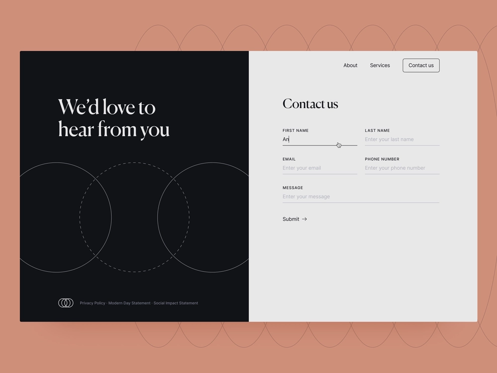

# Prise en main des formulaires adaptatifs découplés

Ce tutoriel vous fournit un cadre de bout en bout pour créer un formulaire adaptatif découplé. Le tutoriel consiste en un cas d’utilisation et plusieurs guides. Chaque guide décrit des fonctionnalités spécifiques et vous aide à les ajouter au formulaire adaptatif découplé créé dans ce tutoriel. Chaque guide se termine par un formulaire adaptatif découplé opérationnel. À la fin de ce didacticiel, vous serez en mesure de :

* créer un formulaire adaptatif découplé ;
* ajouter des règles commerciales à votre formulaire ;
* utiliser Material UI de Google pour appliquer un style au formulaire ;
* préremplir le formulaire ;
* incorporer le formulaire dans une page web.

Vous développerez également des connaissances sur l’architecture, les artéfacts disponibles et la structure JSON des formulaires adaptatifs découplés.

**Commençons par aborder un cas d’utilisation** :

Raya Tan, employée au sein du ministère des Affaires étrangères d’un pays connu pour sa beauté naturelle et son économie touristique florissante, supervise la distribution des formulaires de visa aux touristes. Ces formulaires sont disponibles sur le site web du ministère, les applications mobiles natives et au format PDF, et ce dans plusieurs langues. Cependant, la gestion et la distribution de ces formulaires sur différentes plateformes et technologies peut s’avérer difficile.

Afin d’améliorer l’efficacité et la flexibilité de leur processus de demande de visa, le ministère des Affaires étrangères a décidé d’adopter une approche découplée pour les formulaires adaptatifs. Cette architecture découplée sépare le front-end du back-end, pour davantage de personnalisation et d’évolutivité. Le ministère prévoit d’avoir recours aux composants React Material UI de Google pour améliorer l’expérience utilisateur des formulaires, tout en utilisant les fonctionnalités back-end telles que les signatures numériques, l’intégration des données, la gestion des processus métier, les documents d’enregistrement et l’analyse de l’utilisation.

Le formulaire le plus utilisé par les touristes est le formulaire de contact, qui leur permet de poser des questions et de demander des informations. À ce titre, le ministère des Affaires étrangères a choisi de mettre en œuvre l’approche des formulaires adaptatifs découplés pour ce formulaire. Ce tutoriel vous guidera tout au long du processus de création du formulaire de contact dans cette nouvelle architecture. Le résultat final ressemblera à celui-ci :

