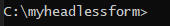
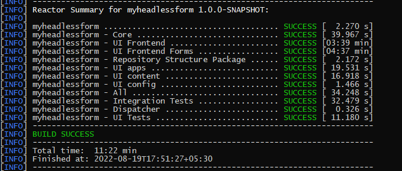
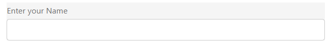
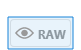
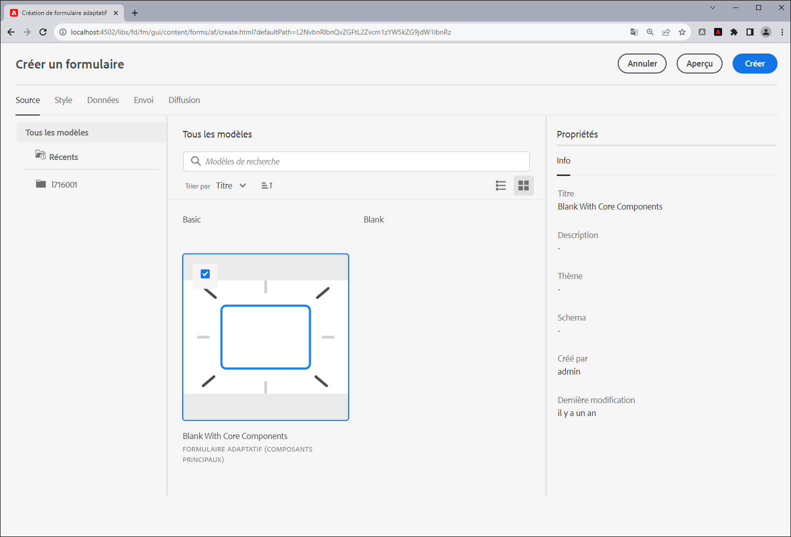

# Créer votre premier formulaire adaptatif sans affichage

Vous pouvez utiliser des formulaires adaptatifs sans affichage Adobe Experience Manager pour créer des applications de formulaires à l’aide de l’interface utilisateur frontale, telle que React, et utiliser le SDK Web de Forms pour des fonctionnalités telles que la gestion de l’état, la validation et les intégrations avec d’autres points de contact.

Par exemple, une organisation We.Org cherche à numériser le parcours d’inscription de ses clients. Leurs développeurs sont très au fait de l’utilisation de l’Angular pour créer des solutions front-end. Ils cherchent à créer un front-end personnalisé lors du déchargement de la validation de formulaire et des signatures électroniques vers des solutions spécialisées.

Les formulaires adaptatifs sans affichage de Adobe Experience Manager offrent aux entreprises la possibilité de créer des formulaires en utilisant leur expertise existante dans les langages frontaux, tout en offrant la prise en charge de l’utilisation des fonctionnalités d’arrière-plan pour créer une expérience de formulaires de classe entreprise.

<!-- >>[!VIDEO](https://video.tv.adobe.com/v/341011/) -->

<!--   -->

## Avant de commencer

* Configurez la variable [environnement de développement](setup-development-environment.md) pour vous permettre de créer et de tester un formulaire adaptatif sans affichage sur votre ordinateur local.
* Les logiciels suivants doivent être installés sur votre machine de développement locale :
   * [Java Development Kit 11](https://experience.adobe.com/#/downloads/content/software-distribution/en/general.html?1_group.propertyvalues.property=.%2Fjcr%3Acontent%2Fmetadata%2Fdc%3AsoftwareType&amp;1_group.propertyvalues.operation=equals&amp;1_group.propertyvalues.0_values=software-type%3Atooling&amp;fulltext=Oracle%7E+JDK%7E+11%7E&amp;orderby=%40jcr%3Acontent%2Fjcr%3AlastModified&amp;orderby.sort=desc&amp;layout=list&amp;p.offset=0&amp;p.limit=14)
   * [Dernière version de Git](https://git-scm.com/downloads). Si vous découvrez Git, voir [Installation de Git](https://git-scm.com/book/en/v2/Getting-Started-Installing-Git).
   * [Node.js 16.13.0 ou version ultérieure](https://nodejs.org/en/download/). Si vous découvrez Node.js pour la première fois, voir [Comment installer Node.js](https://nodejs.dev/en/learn/how-to-install-nodejs).
   * [Maven 3.6 ou version ultérieure](https://maven.apache.org/download.cgi). Si vous découvrez Maven pour la première fois, voir [Installation d’Apache Maven](https://maven.apache.org/install.html).


## Utilisez le projet archetype pour créer un formulaire adaptatif sans affichage

Le projet d’archetype est un modèle maven. Il crée un projet minimal basé sur les bonnes pratiques pour commencer à utiliser les formulaires adaptatifs sans affichage. Elle comprend également la fonctionnalité de formulaires adaptatifs sans affichage pour les environnements de développement as a Cloud Service et local Forms. Il est obligatoire de créer et déployer le projet basé sur l’archétype 37 ou version ultérieure pendant la phase bêta. Une fois le projet bêta, il n’est nécessaire que pour les personnalisations.

Effectuez les étapes suivantes pour créer et générer votre premier formulaire adaptatif sans affichage :

1. [Création et déploiement AEM projet basé sur l’archétype](#create-an-archetype-based-project)
1. [Déployer le projet vers AEM SDK](#deploy-the-project-to-a-local-development-environment)
1. [Créez un schéma JSON du formulaire adaptatif sans affichage et chargez-le sur votre instance AEM SDK](#create-add-json-representation-of-headless-adaptive-forms)
1. [Créer un formulaire adaptatif basé sur le modèle vierge avec composants principaux](#create-adaptive-form-with-blank-with-core-components-template)


### 1. Création et déploiement d’AEM projet basé sur l’archétype {#create-an-archetype-based-project}

Selon le système d’exploitation, exécutez la commande ci-dessous pour créer un projet Experience Manager Forms as a Cloud Service. Utilisez l’archétype version 37 ou ultérieure. Voir [Documentation sur l’archétype](https://experienceleague.adobe.com/docs/experience-manager-core-components/using/developing/archetype/overview.html?lang=fr) pour trouver la dernière version d’Archetype.

**Microsoft Windows**

1. Ouvrez l’invite de commande avec les privilèges d’administrateur (exécutez l’invite de commande ou bash shell en tant qu’administrateur).
1. Exécutez la commande suivante :

   ```shell
     mvn -B org.apache.maven.plugins:maven-archetype-plugin:3.2.1:generate ^
     -D archetypeGroupId=com.adobe.aem ^
     -D archetypeArtifactId=aem-project-archetype ^
     -D archetypeVersion=37 ^
     -D appTitle=myheadlessform ^
     -D appId=myheadlessform ^
     -D groupId=com.myheadlessform ^
     -D includeFormsenrollment="y" ^
     -D includeFormsheadless="y" 
   ```

   * Définir `appTitle` pour définir le titre et les groupes de composants.
   * Définir `appId` pour définir l’artifactId Maven, les noms des dossiers de composants, de configurations et de contenu, ainsi que les noms des bibliothèques clientes.
   * Définir `groupId` pour définir le groupId Maven et le package source Java.
   * Utilisez l’option `includeFormsenrollment=y` pour inclure des configurations, des thèmes, des modèles, des composants principaux et des dépendances spécifiques à Forms, nécessaires à la création de formulaires adaptatifs.
   * Utilisez la variable `includeFormsheadless=y` pour inclure les composants principaux de Forms et les dépendances nécessaires pour inclure la fonctionnalité Forms adaptatif sans affichage. Lors de l’activation de cette option, les éléments suivants sont inclus :
      * La variable **Vide avec les composants principaux** modèle avec [composants principaux](https://experienceleague.adobe.com/docs/experience-manager-core-components/using/introduction.html?lang=fr).
      * un module front React, `ui.frontend.react.forms.af`. Cela vous aide à effectuer le rendu d’un formulaire adaptatif sans interface dans une application de réaction.


**Apple macOS ou Linux**:

1. Ouvrez le terminal en tant qu’utilisateur root. Il vous permet d’exécuter des commandes avec des privilèges d’administrateur. Vous pouvez également utiliser `sudo root` après avoir ouvert la fenêtre du terminal pour exécuter des commandes avec des privilèges d’administrateur.
1. Exécutez la commande suivante :

   ```shell
     mvn -B org.apache.maven.plugins:maven-archetype-plugin:3.2.1:generate \
     -D archetypeGroupId=com.adobe.aem \
     -D archetypeArtifactId=aem-project-archetype \
     -D archetypeVersion=37 \
     -D appTitle=myheadlessform \
     -D appId=myheadlessform \
     -D groupId=com.myheadlessform \
     -D includeFormsenrollment="y" \
     -D includeFormsheadless="y"  
   ```

   * Définir `appTitle` pour définir le titre et les groupes de composants.
   * Définir `appId` pour définir l’artifactId Maven, le composant, la configuration, les noms des dossiers de contenu et les noms des bibliothèques clientes.
   * Définir `groupId` pour définir le groupId Maven et le package source Java.
   * Utilisez l’option `includeFormsenrollment=y` pour inclure des configurations, des thèmes, des modèles, des composants principaux et des dépendances spécifiques à Forms, nécessaires à la création de formulaires adaptatifs.
   * Utilisez la variable `includeFormsheadless=y` pour inclure les composants principaux de Forms et les dépendances nécessaires pour inclure la fonctionnalité Forms adaptatif sans affichage. Lors de l’activation de cette option, les éléments suivants sont inclus :
      * La variable **Vide avec les composants principaux** modèle avec [composants principaux](https://experienceleague.adobe.com/docs/experience-manager-core-components/using/introduction.html?lang=fr).
      * un module de réaction frontale, `ui.frontend.react.forms.af`. Cela vous aide à effectuer le rendu d’un formulaire adaptatif sans interface dans une application de réaction.

Une fois la commande terminée, un dossier de projet portant le nom spécifié dans la variable `appID` est créée. Par exemple, si vous utilisez `appID` avec valeur `myheadlessform`, un dossier nommé `myheadlessform` est créée. Il contient le projet basé sur l’archétype.


### 2. Déployez le projet sur AEM SDK {#deploy-the-project-to-a-local-development-environment}

Lorsque vous déployez le projet sur votre instance AEM SDK, il ajoute la fonctionnalité Forms adaptatif sans affichage, la fonction **Vide avec les composants principaux** modèle et d’autres ressources incluses dans le projet dans votre environnement de développement. <!-- Deploy the project to your local development environment to locally create Headless Adaptive Forms. or deploy directly to your Forms as a Cloud Service environment. !--> Pour effectuer un déploiement sur votre instance AEM SDK :

1. Ouvrez l’invite de commande. Si vous utilisez Windows, ouvrez l’invite de commande avec les droits d’administrateur (exécutez l’invite de commande ou [Coquillage Git bash](https://khushwantsehgal.wordpress.com/2022/06/29/check-if-git-bash-is-running-in-administrator-mode/)  en tant qu’administrateur).

1. Accédez au répertoire du projet créé à l’étape précédente. Par exemple, `/myheadlessform`.

   

1. Exécutez la commande suivante :

   ```shell
   mvn -PautoInstallPackage clean install
   ```

   Attendez le message &#39;BUILD SUCCESS&#39;.
   

   La résolution des dépendances et le déploiement du projet peuvent prendre du temps. En cas d’échec du déploiement du projet, voir [dépannage](troubleshooting.md) article pour les questions courantes et leur résolution.


<!-- *  To learn how to deploy code to AEM as a Cloud Service, see the video in [Deploying to AEM as a Cloud Service]https://experienceleague.adobe.com/docs/experience-manager-cloud-service/content/implementing/deploying/overview.html?lang=en#coding-against-the-right-aem-version) article : -->


### 3. Créez un schéma JSON du formulaire adaptatif sans interface utilisateur graphique et chargez-le dans votre instance AEM SDK {#create-add-json-representation-of-headless-adaptive-forms}

Une Forms adaptative sans affichage est représentée sous la forme d’un fichier JSON. Vous pouvez obtenir un exemple de formulaire à partir de [Storybook](https://opensource.adobe.com/aem-forms-af-runtime/storybook/?path=/story/reference-examples--contact) ou utilisez l’exemple de formulaire inclus dans Archetype Project à l’adresse `[Archetype Project]\ui.content\src\main\content\jcr_root\content\dam\myheadlessform\af_model_sample.json`. Ce document utilise la méthode [introduction](https://opensource.adobe.com/aem-forms-af-runtime/storybook/?path=/story/reference-examples--introduction) formulaire de Storybook. Il s’agit d’un formulaire de champ unique qui vous permet de commencer rapidement à utiliser le Forms adaptatif sans affichage. <!-- The [specifications](/help/assets/Headless-Adaptive-Form-Specification.pdf) document provides detailed information about various components, rules, and constraints for Headless Adaptive Forms -->

Pour créer et charger le schéma :

1. Création d’un fichier texte brut avec extension `.json`. Par exemple, `myfirstform.json`. Vous pouvez créer le fichier n’importe où sur votre système de fichiers ou dans votre projet basé sur AEM Archetype à l’adresse `\<project-name>\ui.content\src\main\content\jcr_root\content\dam\myheadlessform\<formname>.json`
1. Ajoutez le contenu JSON suivant à votre `.json` et enregistrez-le :

   ```JSON
   {
     "adaptiveform": "0.10.0",
     "items": [
       {
         "fieldType": "text-input",
         "label": {
           "value": "Enter your Name"
         },
         "name": "textInput"
       }
     ],
     "metadata": {
       "grammar": "json-formula-1.0.0",
       "version": "1.0.0"
     }
   }
   ```

   Il ajoute un champ unique au formulaire :

   

1. Connectez-vous à [instance AEM SDK locale](setup-development-environment.md#setup-author-instance)
1. Accédez à Adobe Experience Manager > Forms > Forms et documents. Appuyez sur Créer > Chargement de fichier.
1. Sélectionnez la variable `.json` créé à l’étape 2 et téléchargez-le. Vous êtes prêt à créer le formulaire adaptatif sans affichage. Si vous enregistrez le fichier .json dans votre projet AEM basé sur l’archétype à l’adresse `\<project-name>\ui.content\src\main\content\jcr_root\content\dam\myheadlessform\<formname>.json`. Vous pouvez utiliser la variable `mvn -PautoInstallPackage clean install` pour déployer le projet sur votre SDK AEM et `<formname>.json` avec.

En cas d’échec du téléchargement de la variable `.json`, assurez-vous que la variable [AEM projet Archetype a été déployé avec succès](#deploy-the-project-to-a-local-development-environment).

<!-- 1. Open the [contact form](https://opensource.adobe.com/aem-forms-af-runtime/storybook/?path=/story/reference-examples--contact) and tap the [](faq.md#storybook-example) icon on bottom-right side of the Storybook page to view the source code of the headless . 

You can use [Adaptive Forms builder extension for Visual Studio Code](/help/setup-development-environment.md#microsot-visual-studio-code-extension-for-headless-adaptive-forms) to build a JSON schema of your Headless Adaptive Forms. 

You can see [Storybook](https://opensource.adobe.com/aem-forms-af-runtime/storybook/?path=/story/reference-examples--introduction) for sample JSON schemas and list of components, attributes, and properties. You can also see the [specifications document](/help/assets/Headless-Adaptive-Form-Specification.pdf) for detailed information on all the components, constraints, and methods available to define Headless Adaptive Forms.

File extension of a JSON schema of Headless Adaptive Forms is .json. For example, formname.json. Create or add the file to your AEM Archetype based project. For example, `\myheadlessform\ui.content\src\main\content\jcr_root\content\dam\myheadlessform\home-loan.json` -> 

### 3. Deploy the project to a local development environment {#deploy-the-project-to-a-local-development-environment}

You can deploy the project to local development environment. It adds Headless Adaptive Forms functionality, the **Blank with core components** template, JSON schema of form, and other resources included in the project to your development environment. <!-- Deploy the project to your local development environment to locally create Headless Adaptive Forms. or deploy directly to your Forms as a Cloud Service environment. To deploy to your local development environment, use the following command: 

    `mvn -PautoInstallPackage clean install`

If you are on Windows, run the above with Administrative privileges (Run command prompt or [bash shell as an administrator](https://khushwantsehgal.wordpress.com/2022/06/29/check-if-git-bash-is-running-in-administrator-mode/)). For the complete list of commands, see [Building and Installing](https://experienceleague.adobe.com/docs/experience-manager-core-components/using/developing/archetype/using.html?lang=en#building-and-installing).
    
<!-- *  To learn how to deploy code to AEM as a Cloud Service, see the video in [Deploying to AEM as a Cloud Service]https://experienceleague.adobe.com/docs/experience-manager-cloud-service/content/implementing/deploying/overview.html?lang=en#coding-against-the-right-aem-version) article : -->

### 4. Créez un formulaire adaptatif basé sur le modèle Vierge avec composants principaux . {#create-adaptive-form-with-blank-with-core-components-template}

1. Connectez-vous à [AEM instance SDK](http://localhost:4502/).

1. Accédez à Adobe Experience Manager > Forms > Forms et documents.

1. Appuyez sur Créer et sélectionner Formulaire adaptatif. Sélectionnez la variable **Vide avec les composants principaux** et appuyez sur Créer.

   

1. Spécifiez les valeurs des champs de propriété suivants. Les champs Titre et Nom sont obligatoires :

   * **Titre**: spécifie le nom d’affichage du formulaire. Le titre vous permet d’identifier le formulaire dans l’interface utilisateur de Experience Manager Forms.
   * **Nom**: indique le nom du formulaire. Un nœud portant le nom spécifié est créé dans le référentiel. Lorsque vous commencez à saisir un titre, la valeur du champ Nom est automatiquement générée. Vous pouvez modifier la valeur suggérée. Le champ Nom ne peut contenir que des caractères alphanumériques, des traits d’union et des traits de soulignement. Toutes les entrées non valides sont remplacées par un trait d’union.

1. Appuyez sur Créer. Un formulaire adaptatif est créé.

Si vous ne voyez pas le **Vide avec les composants principaux** , assurez-vous que la variable [AEM projet Archetype a été déployé avec succès](#deploy-the-project-to-a-local-development-environment).

### 5. Configuration du formulaire adaptatif pour utiliser le schéma JSON {#configure-adaptive-form-to-use-the-JSON-representation}

Le formulaire adaptatif créé à l’étape précédente est vide. Configurez le formulaire adaptatif pour utiliser le schéma JSON :

1. Connectez-vous à [AEM instance SDK](http://localhost:4502/).

1. Accédez à Adobe Experience Manager > Forms > Forms et documents. Sélectionnez le formulaire adaptatif créé à l’étape précédente et appuyez sur Modifier. Le formulaire adaptatif s’ouvre dans l’éditeur.

1. Appuyez sur le composant Conteneur de Forms adaptatif et sur Propriétés. Il affiche l’explorateur de propriétés dans la barre latérale.

1. Dans l’explorateur de propriétés, développez l’accordéon BASIC, puis spécifiez le chemin du schéma JSON chargé lors d’une étape précédente pour l’option Chemin du document d’exécution Forms. Le composant de conteneur affiche un rendu du formulaire.

1. Dans l’explorateur de propriétés, développez l’accordéon ENVOI et définissez une action Envoyer pour le formulaire adaptatif. Votre formulaire est prêt à être utilisé dans une application de réaction.

1. Pour effectuer le rendu du formulaire, hébergé sur votre machine de développement locale :

   1. Ouvrez le `[Archetype project]\ui.frontend.react.forms.af\.env` et définissez le chemin d’accès au formulaire. Par exemple, /content/forms/af/contact

   1. Ouvrez l’invite de commande, accédez au projet ui.frontend.react.forms.af et exécutez la commande suivante :

      `npm run start`

   1. Une fois l’opération terminée, ouvrez localhost:3000 dans la fenêtre de votre navigateur pour afficher le formulaire adaptatif sans affichage.
   1. Pour tester la fonctionnalité d’envoi, connectez-vous à votre serveur AEM Forms, puis utilisez le **Aperçu du formulaire en HTML** pour ouvrir le formulaire en mode aperçu.

La variable [Storybook](https://opensource.adobe.com/aem-forms-af-runtime/storybook/) fournit une liste de composants et de règles pouvant être définis sur divers Forms adaptatifs sans affichage, ainsi qu’un exemple de schéma JSON de Forms adaptatif sans affichage. Vous pouvez également consulter [spécifications](/help/assets/Headless-Adaptive-Form-Specification.pdf) document pour en savoir plus sur les différentes règles et propriétés liées à Forms adaptatif sans affichage.
