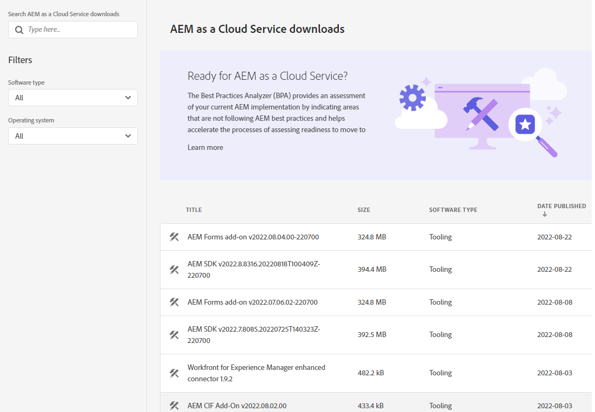
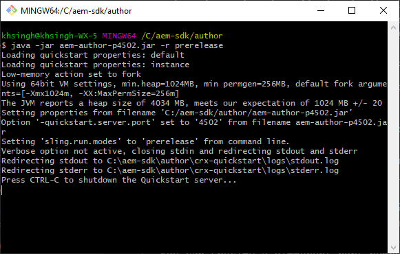

# Configurer un environnement de développement local {#headless-adaptive-forms-setup-development-environment}

Vous pouvez configurer un environnement de développement local pour créer et tester des formulaires adaptatifs découplés sur votre machine locale. L’environnement de développement se compose du SDK AEM et de l’archive de fonctionnalités AEM Forms installée sur le SDK AEM.
<!--
 After a Headless adaptive form or related assets are ready on the local development environment, you can deploy the Headless adaptive form application to your publishing environment. -- >

You require knowledge to build application using react, Git, and Maven to use Headless adaptive forms.

<!-- 

### Download the latest version of AEM as a Cloud Service SDK or Forms feature archive (AEM Forms add-on) from Software Distribution {#software-distribution}

To download the supported version of Adobe Experience Manager as a Cloud Service SDK or Forms feature archive (AEM Forms add-on):

1. Log in to [Software Distribution](https://experience.adobe.com/#/downloads) portal with your Adobe ID.

    >[!NOTE]
    >
    > Your Adobe Organization must be provisioned for AEM as a Cloud Service to download the AEM as a Cloud Service SDK.

1. Navigate to the **[!UICONTROL AEM as a Cloud Service]** tab.
1. Sort by published date in descending order.
1. Click on the latest Adobe Experience Manager as a Cloud Service SDK or Forms feature archive (AEM Forms add-on).
1. Review and accept the EULA. Tap the **[!UICONTROL Download]** button. -->

## Configuration requise {#headless-adaptive-forms-system-requirements}

Pour installer le SDK AEM, votre machine locale doit disposer de la configuration minimale suivante :

* [Java Development Kit 11](https://experience.adobe.com/#/downloads/content/software-distribution/en/general.html?1_group.propertyvalues.property=.%2Fjcr%3Acontent%2Fmetadata%2Fdc%3AsoftwareType&amp;1_group.propertyvalues.operation=equals&amp;1_group.propertyvalues.0_values=software-type%3Atooling&amp;fulltext=Oracle%7E+JDK%7E+11%7E&amp;orderby=%40jcr%3Acontent%2Fjcr%3AlastModified&amp;orderby.sort=desc&amp;layout=list&amp;p.offset=0&amp;p.limit=14).
* [Dernière version de Git](https://git-scm.com/downloads). Si vous découvrez Git, consultez [Installer Git](https://git-scm.com/book/en/v2/Getting-Started-Installing-Git).
* [Node.js 16.13.0 ou version ultérieure](https://nodejs.org/en/download/). Si vous découvrez Node.js, consultez [Comment installer Node.js](https://nodejs.dev/en/learn/how-to-install-nodejs).
* [Maven 3.6 ou version ultérieure](https://maven.apache.org/download.cgi). Si vous découvrez Maven, consultez [Installer Apache Maven](https://maven.apache.org/install.html).

## Configurer l’environnement de développement {#headless-adaptive-forms-procedure-to-setup-development-environment}

Pour configurer un nouvel environnement de développement local et l’utiliser pour développer et tester des formulaires adaptatifs découplés, procédez comme suit :

1. [Configurez le SDK AEM as a Cloud Service](#setup-author-instance).
1. [Ajoutez une archive AEM Forms (module complémentaire AEM Forms Cloud Service) au SDK AEM](#add-forms-archive).

<!--

1. (Optional) [Add Forms-specific users to your local Author instance](#configure-users-and-permissions).
1. (Optional) Install [Adaptive forms builder extension for Microsoft Visual Studio Code](#microsoft-visual-studio-code-extension-for-headless-adaptive-forms). 

-->

### 1. Configurer le SDK AEM as a Cloud Service {#setup-author-instance}

Le SDK AEM as a Cloud Service (SDK AEM) fournit à l’équipe de développement une expérience locale pour créer et tester des formulaires adaptatifs découplés. Vous pouvez utiliser le SDK AEM as a Cloud Service pour créer et prévisualiser des formulaires adaptatifs découplés, et ainsi effectuer localement la plupart des validations liées au développement. Pour configurer une instance de création locale, procédez comme suit :

1. [Téléchargez](https://experience.adobe.com/#/downloads/content/software-distribution/en/aemcloud.html?lang=fr) la dernière version du [!DNL Adobe Experience Manager] SDK as a Cloud Service. Utilisez la colonne Date de publication pour trier et localiser facilement le SDK le plus récent.
Le SDK est au format .zip. La version prise en charge est aem-sdk-2022.7.8085.20220725T140323Z-220700.zip et version ultérieure.

   


1. Procédez à l’extraction du fichier .zip téléchargé dans un répertoire de votre machine locale.
1. Créez un répertoire d’installation pour l’instance de création sur votre machine locale. Par exemple, `~/aem-sdk/author`.
1. Copiez le fichier .jar des fichiers extraits du SDK vers l’emplacement d’installation et renommez le fichier `aem-author-p4502.jar`. La chaîne `p4502` dans le nom de fichier indique le numéro de port à utiliser. Libre à vous de spécifier un autre numéro de port.

   >[!NOTE]
   >
   > Ne double-cliquez pas sur le fichier .jar pour le démarrer. Cette opération se solde par une [erreur](https://experienceleague.adobe.com/docs/experience-manager-learn/cloud-service/local-development-environment-set-up/aem-runtime.html?lang=fr#troubleshooting-double-click).

1. Ouvrez l’invite de commandes :
   * Sous Windows, utilisez l’option **Exécuter en tant qu’administrateur** pour ouvrir l’invite de commandes avec élévation de privilèges.
   * Sous Linux, ouvrez la fenêtre de terminal en tant qu’utilisateur root.

1. Accédez à l’emplacement d’installation contenant le fichier .jar copié, puis exécutez la commande suivante :

   `java -jar aem-author-p4502.jar -r prerelease`

   

   * La commande `-r prerelease` active les fonctionnalités disponibles uniquement dans les programmes de version préliminaire et de version limitée.
   * Utilisez `admin` comme nom d’utilisateur et mot de passe pour le développement local afin de simplifier le processus.

   Une fois AEM lancé, la page de connexion s’ouvre dans le navigateur web. Vous pouvez également ouvrir la page de connexion de l’instance SDK AEM à l’adresse `http://localhost:<port>` dans votre navigateur web. Par exemple : [http://localhost:4502](http://localhost:4502).

1. Connectez-vous à votre instance de création. Appuyez sur l’icône d’, puis sur À propos d’Adobe Experience Manager et assurez-vous que le numéro de version comprend le suffixe PRERELEASE.

   

Si vous ne le voyez pas, arrêtez le serveur, supprimez le dossier `[AEM SDK installation]/crx-quickstart folder` et redémarrez le fichier .jar du SDK AEM avec la commande `-r prerelease`. Pour plus d’options, consultez [Dépannage](/help/troubleshooting.md).

### 2. Ajouter une archive AEM Forms (module complémentaire AEM Forms Cloud Service) au SDK AEM {#add-forms-archive}

L’archive de fonctionnalités AEM Forms as a Cloud Service (module complémentaire AEM Forms Cloud Service) dispose d’outils pour créer des formulaires adaptatifs découplés dans un environnement de développement local. Pour installer l’archive de fonctionnalités, procédez comme suit :

1. Téléchargez et procédez à l’extraction de la dernière version de l’archive de fonctionnalités [!DNL AEM Forms] (module complémentaire AEM Forms) depuis la page [Distribution logicielle](https://experience.adobe.com/#/downloads/content/software-distribution/en/aemcloud.html?fulltext=AEM*+Forms*+add*+on*&amp;orderby=%40jcr%3Acontent%2Fjcr%3AlastModified&amp;orderby.sort=desc&amp;layout=list&amp;p.offset=0&amp;p.limit=20). Utilisez la colonne Date de publication pour trier et localiser facilement la dernière version du SDK. La version prise en charge est aem-forms-addon-2022.07.06.02-220600 et version ultérieure.

1. Accédez au répertoire crx-quickstart/install. Si le dossier n’existe pas, créez-le.
1. Arrêtez votre instance SDK AEM. Vous pouvez fermer la fenêtre d’invite de commandes qui exécute l’instance SDK AEM pour arrêter AEM.
1. Copiez l’archive de fonctionnalités du module complémentaire [!DNL AEM Forms] à partir du fichier `aem-forms-addon-<version>.far`, extrait à l’étape 1, dans le dossier d’installation.
1. Exécutez la commande suivante pour redémarrer l’instance SDK AEM :

   `java -jar aem-author-p4502.jar -r prerelease`

<!-- 

### 3. (Optional) Configure users and permissions {#configure-users-and-permissions}

Create seperate user accounts for Form Developer, Form Practitioner, and end users. These account help you test Headless adaptive forms for various types of users. To create a user account and add roles to the account:

1. Login to your AEM SDK instance.
1. Go to Tools > Security > Users and tap Create. The Create New User wizard opens.
1. In the details tab, specify an ID and Password. All other fields are optional. It is recommended to provide name and an email address.
1. In the Groups tab, search and select user-groups for a user depending on their role. The table below lists all types of users and pre-defined groups for each type of forms users based on their role:
  
    | User Type | AEM Group |
    |---|---|
    | Form developer | [!DNL forms-users] (AEM Forms Users), [!DNL template-authors], [!DNL workflow-users], [!DNL workflow-editors], and [!DNL fdm-authors]  |
    | Customer Experience Lead or UX Designer| [!DNL forms-users], [!DNL template-authors]|
    | AEM administrator | [!DNL aem-administrators], [!DNL fd-administrators] |
    | End user| When a user must log in to view and submit an Adaptive Form, add such users to [!DNL forms-users] group. </br> When no user authentication is required to access Adaptive Forms, do not assign any group to such users.|

<!-- ### 4. (Optional) Install Visual Studio Code extension for Headless adaptive forms {#microsoft-visual-studio-code-extension-for-headless-adaptive-forms}

You can use any IDE for developing Headless adaptive forms. Adobe provides an extension for Microsoft&reg;reg; Visual Studio Code to make it easier for you to navigate structure and develop Headless adaptive forms. The extension adds adaptive forms related IntelliSense capabilities and helps auto-complete Headless adaptive forms JSON syntax. It also adds a panel, titled Forms Tree, to help navigate structure of Headless adaptive form. To use the extension: 

1. Ensure [Microsoft Visual Studio Code 1.62.0 or later](https://code.visualstudio.com/docs/supporting/FAQ#_how-do-i-find-the-version) is installed. If you have an older version or no version installed, download the latest version from [Microsoft Website](https://code.visualstudio.com/docs/setup/setup-overview)
   >[!NOTE]
   >
   >
   > To use Visual Studio from command line on macOS, see [Launching from the command line](https://code.visualstudio.com/docs/setup/mac#_launching-from-the-command-line).

1. Download the [Adaptive forms builder extension](/help/assets/adaptive-form-builder-0.12.0.vsix).

1. Navigate the directory containing the *adaptive-form-builder-[version].vsix* file.

1. Run the following command or see [Install from a VSIX](https://code.visualstudio.com/docs/editor/extension-marketplace#_install-from-a-vsix) article for detailed instructions to install a Visual Studio Code extension from a VSIX file:

    `code -–install-extension adaptive-form-builder-[version].vsix`

    </br> Replace the [version] with actual version of the extension. For example, `code -–install-extension adaptive-form-builder-0.12.0.vsix`

    </br> 

    

<!-- ## Create and setup a react app

Adaptive forms renderer component is a react based component. It requires a react app to run and render a Headless adaptive form. To create and setup react app:

1. Open terminal in Visual Studio code and run the following command to create a react app and installs all related dependencies:

    ```shell
    npx create-react-app [react-app-name] --scripts-version 4.0.3 --template typescript
    ```

    Where [react-app-name] represents name of the project, script version is 4.0.3, and template of type typescript. For example, the following command creates a react app named *headless-forms-demo*.

    ```shell
    npx create-react-app headless-forms-demo --scripts-version 4.0.3 --template typescript
    ```

    It may take some time to create the react app and install all the dependencies. The command creates an empty react app with latest version of react and react-dom dependencies. It does not have any artifacts related to adaptive forms renderer component.

1. Adaptive forms renderer component is based on react spectrum and requires react 16.0.0 and react-dom 16.0.0. To install react 16.0.0 and related dependencies:
    1. Open the Visual Studio code terminal Window or command prompt.
    1. Navigate to the directory of react project.  
    1. Run the following command:

        ```shell
        npm install --save react@16.0.0 react-dom@16.14.0 -force
        ```

1. Run the following command to install adaptive forms renderer component related dependencies:

    ```shell
    npm i --save @aemforms/forms-super-component @aemforms/forms-react-core-components @aemforms/forms-super-component @adobe/react-spectrum @react/react-spectrum
    ```

<!-- 1. Install dependencies for adaptive forms renderer component. Packages for these dependencies are available in Adobe Artifactory. To authenticate with Adobe Artifactory and install dependencies for adaptive forms renderer component:

    1. Create environment variables ARTIFACTORY_USER and ARTIFACTORY_API_TOKEN. The ARTIFACTORY_USER stores Adobe LDAP username and ARTIFACTORY_API_TOKEN stores your [Adobe Artifactory token](https://wiki.corp.adobe.com/display/Artifactory/API+Keys)

    1. Run the following command to set NPM_TOKEN and NPM_EMAIL tokens:

        ```shell

        auth=$(curl -s -u${ARTIFACTORY_USER}:${ARTIFACTORY_API_TOKEN} https://artifactory.corp.adobe.com/artifactory/api/npm/auth)
        export NPM_TOKEN=$(echo "${auth}" | grep "_auth" | awk -F " " '{ print $3 }')
        export NPM_EMAIL=$(echo "${auth}" | grep "email" | awk -F " " '{ print $3 }')
        ```

        These tokens are required to communicated with Adobe Artifactory.

    1. Create a .npmrc file in the react project.

        

    1. Add the following code to the file:

        ```shell
        @aemforms:registry=https://artifactory.corp.adobe.com/artifactory/api/npm/npm-aem-release/
        @react:registry=https://artifactory.corp.adobe.com/artifactory/api/npm/npm-react-release/
        @quarry:registry=https://artifactory.corp.adobe.com/artifactory/api/npm/npm-adobe-release-local/
        //artifactory.corp.adobe.com/artifactory/api/npm/npm-adobe-release-loca/:_auth=${NPM_TOKEN}
        //artifactory.corp.adobe.com/artifactory/api/npm/npm-aem-release/:_auth=${NPM_TOKEN}
        //artifactory.corp.adobe.com/artifactory/api/npm/npm-react-release/:_auth=${NPM_TOKEN}
        _auth=${NPM_TOKEN}
        email=${NPM_EMAIL}
        always-auth=true
        ```

        It defines the antifactory repositories to use for Headless adaptive forms, react, and quarry related scope.
    1. Run the following command to install adaptive forms renderer component related dependencies:

    ```shell
    npm i --save @aemforms/crispr-react-bindings @aemforms/crispr-react-core-components @adobe/react-spectrum @react/react-spectrum
    ```
 
-->
Votre environnement de développement local est prêt. Vous pouvez à présent créer un formulaire adaptatif découplé.
