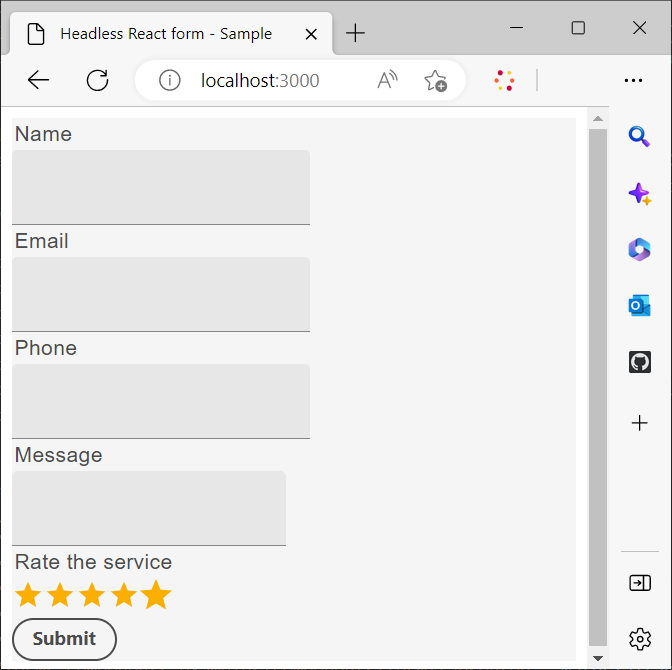
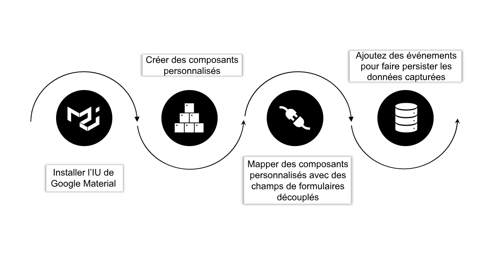
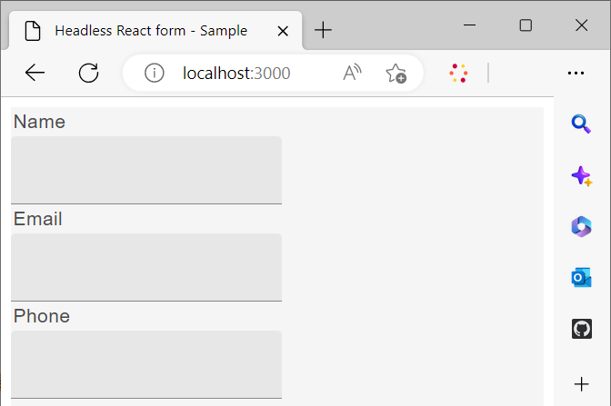

# Utilisation d’une bibliothèque de réaction personnalisée pour effectuer le rendu d’un formulaire sans interface utilisateur

Vous pouvez créer et implémenter des composants personnalisés pour personnaliser l’apparence et les fonctionnalités (comportement) de vos formulaires adaptatifs sans affichage selon les besoins et les directives de votre entreprise.

Ces composants ont deux objectifs principaux : contrôler l’aspect ou le style des champs de formulaire et stocker les données collectées à travers ces champs dans l’instance de modèle de formulaire. Si cela semble déroutant, ne vous inquiétez pas - nous explorerons ces objectifs plus en détail sous peu. Pour l’instant, concentrons-nous sur les étapes initiales de la création de composants personnalisés, du rendu du formulaire à l’aide de ces composants et de l’utilisation d’événements pour enregistrer et envoyer des données à un point de terminaison REST.

Dans ce tutoriel, les composants de l’interface utilisateur Matériau Google sont utilisés pour démontrer comment générer un formulaire adaptatif sans affichage à l’aide de composants React personnalisés. Cependant, vous n’êtes pas limité à cette bibliothèque et êtes libre d’utiliser n’importe quelle bibliothèque de composants React ou de développer vos propres composants personnalisés.

Dans la conclusion du présent article, la _Nous contacter_ formulaire créé dans [Création et publication d’un formulaire sans tête à l’aide du kit de démarrage](create-and-publish-a-headless-form.md) L’article se transforme comme suit :




Les principales étapes nécessaires à l’utilisation des composants de l’interface utilisateur Google Matériau pour générer un formulaire sont les suivantes :



## 1. Installation de l’interface utilisateur matérielle de Google

Par défaut, le kit de démarrage utilise [Le spectre de l&#39;Adobe](https://spectrum.adobe.com/) composants. Définissons-le pour utiliser [Interface utilisateur du matériel de Google](https://mui.com/):

1. Assurez-vous que le kit de démarrage n’est pas en cours d’exécution. Pour arrêter le kit de démarrage, ouvrez votre terminal, accédez à la **response-starter-kit-aem-headless-forms**, puis appuyez sur Ctrl-C (identique sous Windows, Mac et Linux).

   Ne tentez pas de fermer le terminal. La fermeture de votre terminal n’arrête pas le kit de démarrage.

1. Exécutez la commande suivante :

```shell
    
    npm install @mui/material @emotion/react @emotion/styled --force
    
```

Il installe les bibliothèques npm de l’interface utilisateur Matériau Google et ajoute les bibliothèques aux dépendances des kits de démarrage. Vous pouvez désormais utiliser les composants de l’interface utilisateur matérielle pour effectuer le rendu des composants de formulaire.


## 2. Création de composants React personnalisés

Créons un composant personnalisé qui remplace le composant par défaut. [saisie de texte](https://spectrum.adobe.com/page/text-field/) composant avec [Champ de texte de l’interface utilisateur de Google](https://mui.com/material-ui/react-text-field/) composant.

Un composant distinct est requis pour chaque type de composant ([fieldType](https://opensource.adobe.com/aem-forms-af-runtime/storybook/?path=/story/reference-json-properties-fieldtype--text-input) ou : type) utilisé dans une définition de formulaire sans affichage. Par exemple, dans le formulaire de contact que vous avez créé dans la section précédente, les champs Nom, Email et Téléphone sont de type `text-input` ([fieldType: &quot;text-input&quot;](https://opensource.adobe.com/aem-forms-af-runtime/storybook/?path=/docs/adaptive-form-components-text-input-field--def)) et que le champ du message est de type `multiline-input` ([&quot;fieldType&quot;: &quot;multiline-input&quot;](https://opensource.adobe.com/aem-forms-af-runtime/storybook/?path=/docs/reference-json-properties-fieldtype--multiline-input)).


Créons un composant personnalisé pour superposer tous les champs de formulaire qui utilisent la variable [fieldType: &quot;text-input&quot;](https://opensource.adobe.com/aem-forms-af-runtime/storybook/?path=/docs/adaptive-form-components-text-input-field--def) avec la propriété [Champ de texte de l’interface utilisateur matérielle](https://mui.com/material-ui/react-text-field/) composant.


Pour créer le composant personnalisé et mapper le composant personnalisé avec le [fieldType](https://opensource.adobe.com/aem-forms-af-runtime/storybook/?path=/docs/adaptive-form-components-text-input-field--def) property :

1. Ouvrez le **response-starter-kit-aem-headless-forms** dans un éditeur de code et accédez à `\react-starter-kit-aem-headless-forms\src\components`.


1. Créez une copie de la fonction **curseur** ou **richtext** et renommez le dossier copié en **matérialtextfield**. Le curseur et le texte enrichi sont deux exemples de composants personnalisés disponibles dans l’application de démarrage. Vous pouvez les utiliser pour créer vos propres composants personnalisés.

   

1. Ouvrez le `\react-starter-kit-aem-headless-forms\src\components\materialtextfield\index.tsx` et remplacez le code existant par le code ci-dessous. Ce code renvoie et génère un [Champ de texte de l’interface utilisateur de Google](https://mui.com/material-ui/react-text-field/) composant.

```JavaScript
 
     import React from 'react';
     import {useRuleEngine} from '@aemforms/af-react-renderer';
     import {FieldJson, State} from '@aemforms/af-core';
     import { TextField } from '@mui/material';
     import Box from '@mui/material/Box';
     import { richTextString } from '@aemforms/af-react-components';
     import Typography from '@mui/material/Typography';


     const MaterialtextField = function (props: State<FieldJson>) {

         const [state, handlers] = useRuleEngine(props);

         return(

         <Box>
             <Typography component="legend">{state.visible ? richTextString(state?.label?.value): ""} </Typography>
             <TextField variant="filled"/>
         </Box>

         )
     }

     export default MaterialtextField;
```


La variable `state.visible` vérifie si le composant est défini pour visible. Si tel est le cas, le libellé du champ est récupéré et affiché à l’aide de la fonction `richTextString(state?.label?.value)`.


Votre composant personnalisé `materialtextfield` est prête. Définissons ce composant personnalisé pour remplacer toutes les instances de  [fieldType: &quot;text-input&quot;](https://opensource.adobe.com/aem-forms-af-runtime/storybook/?path=/docs/adaptive-form-components-text-input-field--def) avec le champ de texte de l’interface utilisateur Matériau de Google .

## 3. Mappage d’un composant personnalisé avec des champs de formulaire sans en-tête

Le processus d’utilisation de composants de bibliothèque tiers pour le rendu des champs de formulaire est connu sous le nom de mappage. Vous mappez chaque ([fieldType](https://opensource.adobe.com/aem-forms-af-runtime/storybook/?path=/story/reference-json-properties-fieldtype--text-input)) au composant correspondant de la bibliothèque tierce.

Toutes les informations relatives au mappage sont ajoutées au `mappings.ts` fichier . La variable `...mappings` dans la variable `mappings.ts` fait référence aux mappages par défaut, qui recouvrent les[fieldType](https://opensource.adobe.com/aem-forms-af-runtime/storybook/?path=/story/reference-json-properties-fieldtype--text-input) ou : type) avec [Spectre des Adobes](https://spectrum.adobe.com/page/text-field/) composants.

Pour ajouter un mappage pour la variable  `materialtextfield` composant, créé à la dernière étape :

1. Ouvrez le fichier `mappings.ts`.

1. Ajoutez l’instruction d’importation suivante pour inclure la variable `materialtextfield` au composant `mappings.ts` fichier :


   ```JavaScript
       import MaterialtextField from "../components/materialtextfield";
   ```

1. Ajoutez l’instruction suivante pour mapper la variable `text-input` avec le composant matérialtextfield .


   ```JavaScript
       "text-input": MaterialtextField
   ```

   Le code final du fichier ressemble à ce qui suit :

   ```JavaScript
         import { mappings } from "@aemforms/af-react-components";
         import MaterialtextField from "../components/materialtextfield";
   
   
         const customMappings: any = {
           ...mappings,
           "text-input": MaterialtextField
        };
        export default customMappings;
   ```

1. Enregistrez l’application, puis exécutez-la. Les trois premiers champs du formulaire sont rendus à l’aide de [Champ de texte de l’interface utilisateur de Google](https://mui.com/material-ui/react-text-field/):

   


   De même, vous pouvez créer des composants personnalisés pour les champs de message (&quot;fieldType&quot;: &quot;multi-line-input&quot;) et évaluer le service (&quot;fieldType&quot;:&quot;number-input&quot;). Vous pouvez cloner le référentiel Git suivant pour les composants personnalisés du message et évaluer les champs de service :

   [https://github.com/singhkh/react-starter-kit-aem-headless-forms](https://github.com/singhkh/react-starter-kit-aem-headless-forms)

## Étape suivante

Vous avez réussi à rendre le formulaire avec des composants personnalisés qui utilisent l’interface utilisateur Google Matériau. Avez-vous tenté d’envoyer le formulaire en cliquant sur le bouton Envoyer (mappé avec le composant d’interface utilisateur matériel Google correspondant) ? Si ce n&#39;est pas le cas, allez-y et essayez.

Le formulaire envoie-t-il les données à une source de données quelconque ? Non? Ne vous inquiétez pas. Cela est dû au fait que votre formulaire n’est pas configuré pour communiquer avec la bibliothèque runtime.

Comment configurer votre formulaire pour communiquer avec lui ? Nous avons bientôt un article qui expliquera tout en détail. Restez à l&#39;écoute !
